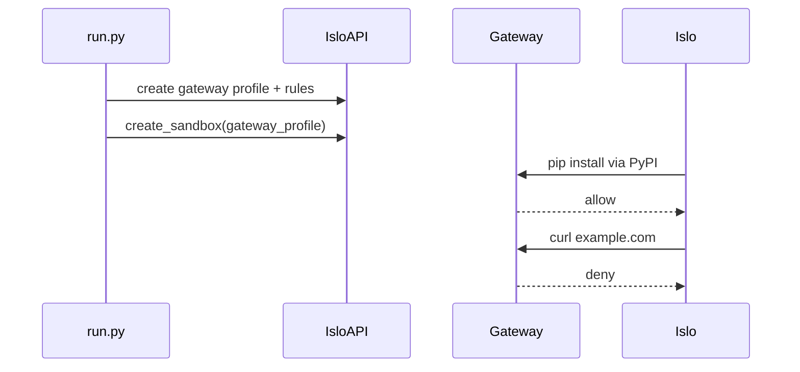

# Gateway allowlist

Restrict internet egress in Islo to package registries so untrusted code can install dependencies but cannot reach arbitrary hosts.

## Goal

Create a gateway profile that allows PyPI and npm registry traffic, denies everything else, and prove it in Islo.

## When to use

- Running agents or scripts that need `pip install` but should not browse the open internet
- Learning Islo gateway egress rules before building stricter policies
- Complement to [`mount-s3`](../mount-s3/) which uses gateway for **AWS IAM**, not host allowlisting

## Prerequisites

- Islo account and API key
- Python 3.10+ and [uv](https://docs.astral.sh/uv/)

## Environment variables

| Variable | Required | Description |
|----------|----------|-------------|
| `ISLO_API_KEY` | Yes | API key from [app.islo.dev/api-keys](https://app.islo.dev/api-keys) |
| `ISLO_BASE_URL` | No | Control-plane URL (default `https://api.islo.dev`) |

## Quick start

```bash
cd recipes/gateway-allowlist
uv sync
cp .env.example .env
# edit .env with your API key

uv run python run.py
```

## Verify success

The last line of output should be:

```
PASS: gateway-allowlist
```

You should also see `Blocked curl to example.com as expected` when the deny rule works.

## How it works

1. Creates or reuses gateway profile `recipes-deps-only` with allow rules for Debian apt, PyPI, npm, plus a catch-all deny.
2. Starts in Islo (SDK: `create_sandbox`) and installs Python via apt over the gateway.
3. Runs `pip install httpx` in a venv (allowed) and `curl https://example.com` (blocked).



## Troubleshooting

| Symptom | Fix |
|---------|-----|
| `python3: not found` | Bootstrap apt step failed — check stderr; ensure `*.debian.org` gateway rule exists |
| `pip install` fails | Confirm allow rules include `pypi.org` and `files.pythonhosted.org` |
| `apt-get` fails on `download.docker.com` | Expected under a restricted gateway — bootstrap removes the Docker apt source first |
| `apt-get` fails otherwise | Verify `*.debian.org` is allowed (apt CDN redirects) |
| `curl example.com` succeeds | Gateway profile may not be attached; check profile name |
| Profile already exists with wrong rules | Re-run adds missing rules idempotently, or delete `recipes-deps-only` in the dashboard |

## Related recipes

- [`mount-s3`](../mount-s3/) — gateway + AWS cloud role for S3 access
